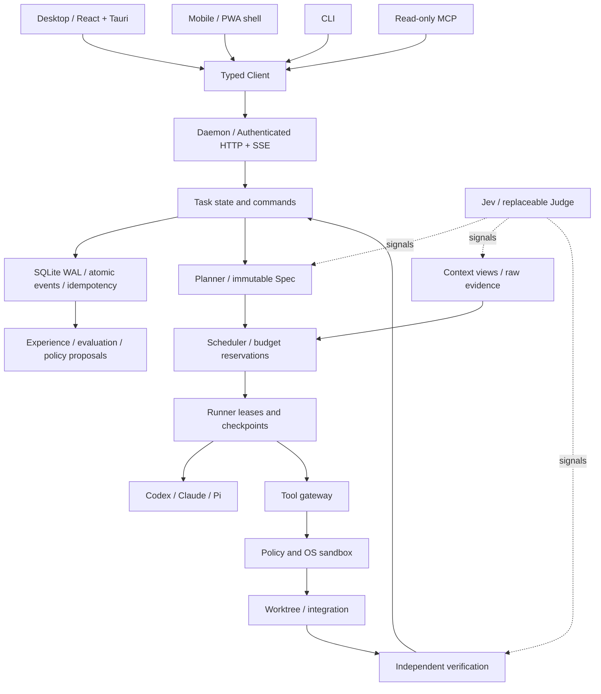
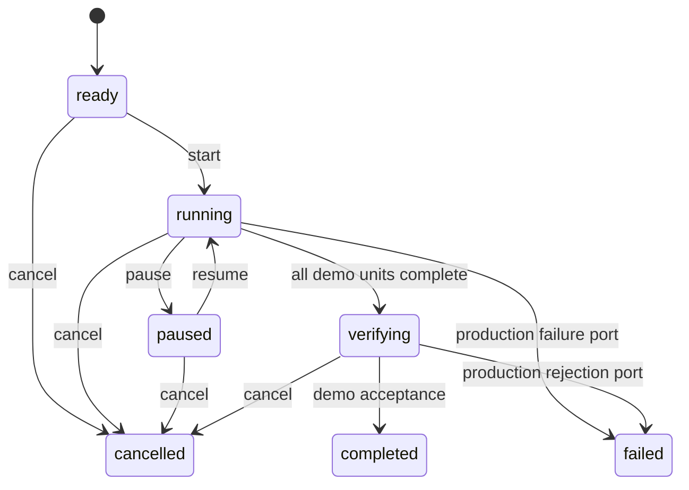

# 整体架构

本文件描述当前工程与完整产品的映射。设计全集见 [v3](technical-spec-v3.md)，实际完成度见 [status](status.md)。

## 控制面与执行面

当前真实链路：客户端 → HTTP → 运行时校验 → 核心演示命令 → SQLite 事务 → 事件查询/SSE。其余模块已建立类型或基础函数，不代表生产执行链路已接通。

官网是独立静态前端，不连接任务数据库。Web renderer 无任意 shell、文件系统或密钥桥接能力。

## 状态与命令

演示命令 `advance` 仅完成一个依赖已满足的模拟单元，四个单元结束后进入 verifying，再次 advance 才完成。代码和 UI 都明确提示没有真实代码验收。失败、恢复、等待资源/用户等完整状态在真实 Runner 接入时扩展，必须带迁移和并发测试。

核心状态不可由 UI 或 Agent 直接改写。XState 定义允许的生命周期；核心命令控制工作单元推进。恢复的是持久化演示状态，不能把它当作外部进程、远端工具、模型会话的完整恢复。

## 事务与事件

一次写命令在 `BEGIN IMMEDIATE` 中完成：

1. 查找幂等键；相同请求返回之前的结果，不产生新事件。
2. 验证任务修订号和状态条件。
3. 保存新快照。
4. 插入单调递增的事件。
5. 保存幂等回执并提交。

不同请求复用幂等键返回冲突。旧修订请求返回冲突。失败事务不改变状态，不产生“成功”事件。SSE 读取同一张事件表，因此无需依赖内存广播才能补读。

当前 JSON 事件查询每页最多 1000 条，使用最后一条 sequence 继续读取。UI 为基础轮询；SSE 入口已测试补读，但 UI 的完整流式客户端尚待接入。

## 产物与恢复

CAS 使用 SHA-256 文件名、临时文件与原子重命名；读取校验长度和摘要。它是基础文件存储，不宣称具备掉电级 fsync、跨进程租约、配额和备份工具。原始产物与上下文视图分离。

完整 CarrierCheckpoint 应绑定仓库基线、环境、规格、产物、会话、预算与未决副作用。未知副作用先对账再重试。Git worktree 不承担安全沙箱职责。

## 本地和远程边界

当前服务只允许 127.0.0.1，认证使用本地随机令牌，并核对 Host 和 Origin。移动端当前只能本机预览。完整远程控制必须增加可信 TLS 通道、设备配对、设备级凭据、撤销和操作绑定审批；不能通过改成 0.0.0.0 就视作实现。
