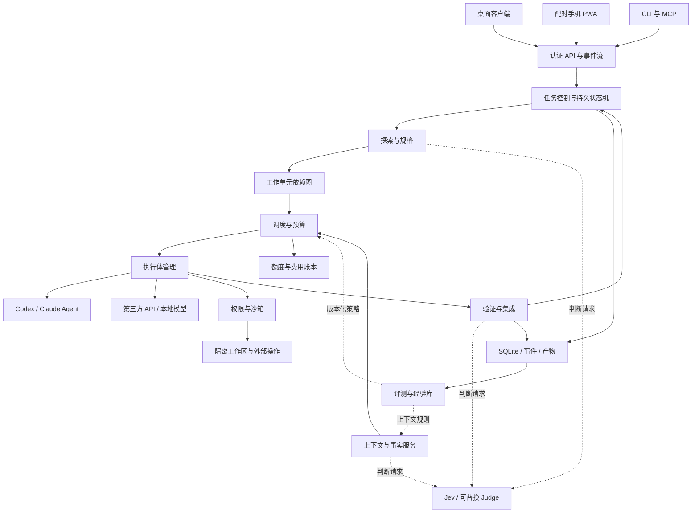

> Jevis 设计基线存档：下文为实现前的完整 v3 方案。当前工程状态请以 [实现状态](status.md) 为准，不能把本方案的设计能力当作已交付功能。

# Jevis 模型编排器技术方案 v3

**让同样的 AI 预算完成更多合格工作，让强模型的能力覆盖更大的项目。**

日期：2026-09-19  
状态：完整产品技术设计，供立项与实现评审；尚未实现或实测。  
范围：全部章节属于同一完整交付，不划分功能优先级、MVP 或发布阶段。模块依赖仅表达工程关系。  
依据：《模型编排器设计规范 v2》及本次产品定位讨论。附件中的操作说明仅作设计参考。

## 1. 产品目标

面向持续进行复杂开发的个人开发者和小团队，把强模型、普通模型、本地模型及编码 Agent 组成能够分工、交接、验收、恢复的工作系统。

用户提供目标、仓库、可用供给与预算。系统决定每个工作单元交给谁、提供哪些材料、执行到哪里检查、何时请更强的执行体介入。用户可以指定模型、修改策略、查看依据和接管任务。

| 用户问题 | 产品机制 | 可验证的收益 |
|---|---|---|
| 强模型额度消耗在重复工作上 | 子任务独立选择模型与推理配置 | 每个合格交付消耗的强模型资源下降 |
| 普通模型需要反复纠正 | 强模型提供规格、示例和约束 | 人工修复时间与返工减少 |
| 多个 Agent 重复读仓库 | 共享事实、版本化产物、按需选材 | 重复读取和无效输入减少 |
| 不知道该补材料还是换模型 | 基于证据的修复、求助、升级、重规划 | 无进展循环减少 |
| 额度用尽后手动搬运现场 | 配额治理、检查点、跨执行体交接 | 中断损失减少 |
| 多模型需要用户自行协调 | 统一任务、结果与审批界面 | 人工协调次数下降 |

核心指标是**预算约束内的合格交付量**，同时观察质量、费用、强模型额度、用户等待及修复时间。不能仅优化 token 数，不能靠省略检查获得“节省”。

强模型默认承担高杠杆、高不确定性的工作，也允许直接处理困难实现。普通模型承担有清晰条件和验收方式的工作。短任务允许直接执行，避免为了分工产生额外开销。

## 2. 完整交付范围

- macOS、Windows、Linux 桌面客户端；本地后台编排服务；CLI 和受控 MCP 入口。
- 手机可用的远程控制 PWA：查看、提交、暂停、审批和读取结果；代码执行发生在配对主机。
- Codex、Claude Agent SDK、第三方模型 API、本地推理端点；供给配置、能力探测、费用和额度管理。
- 仓库探索、规格生成、子 Agent 分工、上下文构建、工具执行、验收、集成及失败处理。
- Jev 判断服务及可替换后端；问题包、阈值、模型版本和回归样例管理。
- 工作区隔离、状态持久化、断点恢复、额度迁移、权限与审计。
- 经验库、离线评测、策略提案、影子评估和受控策略更新。
- 完整界面、扩展协议、开源工程、跨平台打包、升级和诊断。

产品不训练基础模型，不出售账号或共享凭据，不依赖绕过订阅限制。团队可以共享策略与评测包；运行凭据和私有代码按用户、项目隔离。客户端可连接多台主机，每台主机独立执行和存储；本方案不包含跨主机分布式事务或共享 SQLite。

## 3. 技术选型

| 层 | 选型 | 作用 |
|---|---|---|
| 桌面 | Tauri 2 + React + TypeScript | 跨平台 UI 与原生能力边界 |
| 编排 | 独立 Node.js LTS 服务，随客户端锁定并分发运行时 | UI 关闭与任务生命周期分离 |
| 持久化 | SQLite WAL + 内容寻址产物目录 | 事务状态、事件与大文件分离 |
| 代码隔离 | Git worktree + 单独的执行沙箱 | 改动隔离及实际权限约束 |
| 客户端通信 | 版本化 HTTP API + SSE | 快照、命令、断线补事件 |
| 编码供给 | Agent Adapter 与 Inference Adapter 并存 | 保留现成 Agent 能力及自控推理循环 |
| 判断层 | Jev Adapter，经统一 Judge 接口调用 | 可替换、可标定、可降级 |
| 检索 | ripgrep、语言符号索引、SQLite FTS5；可插拔向量索引 | 精确与语义检索结合 |
| 凭据 | 系统凭据库，数据库仅保存引用 | 密钥不进入一般日志或模型上下文 |
| 外部宿主 | OpenClaw 等通过 API/MCP 集成 | 核心不依赖某个外壳内部钩子 |

Tauri 外部二进制机制可用于打包编排运行时；每个平台的 SDK、原生模块和沙箱必须分别验证。[S8] SQLite WAL 存在本地主机磁盘，不放网络共享目录，备份走一致性机制。[S9]

上述为选定技术方向，并非现有适配器均已验证。依赖锁版本，适配器建立 SDK/CLI 兼容矩阵。

## 4. 总体架构



Jev 提供判断信号；预算、锁、审批、状态转移和提交由确定性代码执行。模块之间使用版本化契约与事件，不通过共享可变对话历史协调。

| 模块 | 责任 | 主要输出 |
|---|---|---|
| Project Service | 仓库、基线、用户未提交改动 | 项目快照 |
| Supply Registry | 接入、能力、认证模式、版本、健康 | 可用供给清单 |
| Task Analyzer | 需求与任务特征，保留不确定项 | 需求及特征观察 |
| Spec Service | 规格、接口、工作单元、修订 | 版本化规格与依赖图 |
| Context Service | 材料选择、缓存、摘要和取回 | 上下文包与选择记录 |
| Judge Service | 批量原子判断，不执行动作 | 概率、版本与用量 |
| Scheduler | 候选选择、并发、预算和下一动作 | 分配及预留 |
| Runner Manager | 会话、流事件、取消和心跳 | 运行结果与产物 |
| Tool Broker | 动作前权限与操作记录 | 工具结果 |
| Workspace Service | 工作区、资源锁与集成 | 集成版本 |
| Verification Service | 检查、审查与目标验收 | 证据化 Verdict |
| Quota Service | 共享额度、预留和结算 | 多资源预算快照 |
| State Service | 事务、事件、去重和恢复 | 持久快照 |
| Learning Service | 结果分析与策略评测 | 可回滚策略提案 |

## 5. 供给接入与子 Agent

### 5.1 两种执行体

**Agent Adapter**：对接已有工具循环的编码代理。外层控制工作单元、目录、权限、预算、验收与交接。Codex 通过官方 SDK 或 app-server；Claude 通过 Agent SDK 或受支持的程序化入口。[S1][S2][S3]

**Inference Adapter**：直接调用模型 API，系统掌管消息、工具定义、工具执行、上下文与停止。分别支持 OpenAI Responses、Anthropic Messages、经过探测的 OpenAI-compatible 接口及本地端点；不假定“兼容”就具有相同的工具、流事件、用量和错误行为。

评测对象是完整执行配置：provider、modelRevision、adapterVersion、harnessVersion、reasoningConfig、contextPolicy。相同模型在不同工具循环中不能视作能力相同。

### 5.2 能力登记

```ts
interface SupplyProfile {
  id: string;
  provider: string;
  modelId: string;
  modelRevision?: string;
  transport: 'agent' | 'inference';
  adapterId: string;
  authRef: string;                 // 凭据库引用
  quotaPoolIds: string[];          // 多模型可能共享同一账户额度
  reasoningOptions: string[];
  capabilities: {
    vision: boolean; tools: boolean; structuredOutput: boolean;
    cancel: boolean; resumeSession: boolean;
    toolInterception: boolean; childModelControl: boolean;
    usageReporting: boolean; sandboxProfiles: string[];
  };
  controls: Record<string, 'enforced' | 'observed' | 'unsupported'>;
  contextTokens?: number;
  concurrency?: number;
  dataPolicyRef: string;
  health: 'ready' | 'throttled' | 'unavailable' | 'auth_required';
}
```

未知能力、费用或额度必须标记 unknown，不当作免费、无限或已支持。连接做只读探测；产生费用的测试调用单独标识。能力快照带时间、版本及证据。

如果任务要求工具级拦截，但适配器只能观察结果，则该执行体不能进入候选。预算与权限是可验证控制，不是给模型写一句“请遵守”。

### 5.3 子任务独立分配

每个子任务重新选择模型及推理配置，不机械继承主会话。父模型可以提出候选，调度器检查预算、能力和任务适配。Claude 已支持子 Agent 独立模型配置；本产品的价值在自动分配、材料准备和验收反馈。[S4]

外层工作单元是依赖与预算权威。内部递归子 Agent 默认关闭；允许时必须能记录子运行、权限和用量，消耗归入同一父预算。不能限制或观测的内部派生标为部分可控，从严格预算任务中排除。

支持单元级模型固定、执行中求助及明确升级；任何策略不得覆盖用户明确指定的模型约束。

### 5.4 认证与订阅

采用受支持的官方登录方式或 API key，不读取第三方私有凭据文件来模拟未公开推理接口。用户自配转发端点需要展示数据去向。

订阅所有权不自动构成第三方产品调用权限。Claude Agent SDK 当前文档限制未经批准的第三方产品提供 claude.ai 登录或额度接入。[S3] 注册表按通道保存允许的认证模式；不支持的接入明确显示不可用。

### 5.5 执行适配器协议

```ts
interface RunHandle { runId: string; adapterSessionId?: string }
interface RunEvent {
  runId: string; sequence: number; observedAt: string;
  kind: 'started' | 'progress' | 'tool_request' | 'tool_result'
      | 'artifact' | 'usage' | 'input_required' | 'finished' | 'error';
  payloadRef: string;
}
interface RunnerAdapter {
  describe(): Promise<SupplyProfile>;
  start(unit: WorkUnit, context: Ref, executionPolicy: Ref): Promise<RunHandle>;
  events(handle: RunHandle, after?: number): AsyncIterable<RunEvent>;
  inspect(handle: RunHandle): Promise<{
    status: 'running' | 'finished' | 'unknown'; result?: RunResult
  }>;
  cancel(handle: RunHandle): Promise<'confirmed' | 'requested' | 'unsupported'>;
  resume?(checkpoint: Ref): Promise<RunHandle>;
}
```

tool_request 仅在适配器支持实际拦截时表示待授权调用，不能把事后观察伪装成可阻断事件。内部 SDK 事件与本协议间保留映射及原始引用；无法提供确切状态就返回 unknown。第三方模型请求由 InferenceRunner 管理循环，使用同一外部协议。

## 6. 任务契约与状态

### 6.1 核心对象

```ts
type Ref = { id: string; version: number; hash: string };
type CheckRef = {
  id: string;
  kind: 'deterministic' | 'semantic' | 'review';
  required: boolean;
  evidenceRequired: string[];
};

interface WorkUnit {
  id: string;
  taskId: string;
  spec: Ref;
  role: 'explore' | 'plan' | 'implement' | 'review' | 'integrate';
  goal: string;
  nonGoals: string[];
  deps: string[];
  dependencyArtifacts: Ref[];
  readScope: string[];
  writeScope: string[];
  resourceClaims: Array<{ resource: string; access: 'read' | 'write' }>;
  invariants: Ref[];
  checks: CheckRef[];
  contextManifest: Ref;
  expectedBase: Ref;
  featureObservationIds: string[];
  budget: {
    moneyCap: number; wallClockMs: number;
    maxTurns: number; maxToolCalls: number; maxRepairs: number;
    maxChildren: number; maxDepth: number;
    quotaReservationIds: string[];
  };
  authority: {
    mayProposeRespec: boolean;
    maySpawnManagedChildren: boolean;
  };
}

interface Evidence {
  id: string;
  source: 'user' | 'repository' | 'tool' | 'external' | 'model';
  artifact: Ref;
  sourceLocator: string;
  observedAt: string;
  revision?: string;
  expiresAt?: string;
  status: 'observed' | 'inferred' | 'verified' | 'superseded';
}

interface RunResult {
  runId: string; unitId: string; attempt: number;
  spec: Ref; base: Ref;
  artifacts: Ref[]; evidenceIds: string[];
  claimedComplete: boolean;       // 自述，不代表验收通过
  actualModel?: string;
  usageRef: string;
  status: 'completed' | 'failed' | 'cancelled' | 'interrupted';
}
```

正式契约使用 JSON Schema、语义校验和数据库约束。模型输出不能直接当作合法 WorkUnit。特征包括难度、复用价值、歧义、验证覆盖、失败影响、耦合程度及证据充分性；每项携带来源与不确定性，不能伪装成精确真值。

### 6.2 规格与修订

Spec 包含目标、假设、非目标、接口约定、示例、全局不变量、工作单元图、验收映射、风险和未决问题。规则检查必填项、依赖环、引用、资源冲突和验收覆盖；Jev 辅助检查表述明确性与语义遗漏。架构取舍交给有推理能力的执行体。

验收通过后生成 AcceptedSpec 记录及哈希；派发时在事务中检查状态、版本和政策，不能仅靠时间戳或 TypeScript 类型。

执行体只提出修订建议。新规格产生后计算依赖影响闭包：受影响排队工作失效，运行中工作到安全点停止或取消，旧产物重新验证。无关工作保留。

### 6.3 状态机

任务主路径：draft → analyzing → planning → running → integrating → verifying → completed。

旁路状态：paused、waiting_input、waiting_budget、recovering、failed、cancelled。恢复需满足状态前置条件，不允许任意跳转。

单元主路径：pending → ready → reserved → running → submitted → verifying → accepted。失败进入 repair、respec 或 failed；重跑新建 attempt，不覆盖旧结果。

完成必须同时满足：必要单元 accepted；最终集成版本检查通过；无待决副作用或必要审批；交付与当前规格一致。聊天输出“完成”不能修改任务完成状态。

### 6.4 承载包与检查点

承载包是可重建的任务现场，检查点是其中一个已持久化、一致的版本。普通摘要不是完整检查点。

```ts
interface CarrierCheckpoint {
  id: string; taskId: string; stateVersion: number; lastEventSequence: number;
  goalRef: Ref; spec: Ref; policy: Ref;
  decisionRefs: Ref[]; evidenceRefs: Ref[];
  acceptedArtifacts: Ref[];
  openQuestions: string[]; remainingCheckIds: string[];
  unitStatesRef: Ref; workspaceSnapshot: Ref; environmentManifest: Ref;
  operationLedgerVersion: number;
  pendingOperationIds: string[];
  quotaSnapshot: Ref;
  adapterSessions: Array<{ runId: string; adapterId: string; sessionId?: string }>;
  createdAt: string;
}
```

State Service 以事务发布检查点；各 Runner 只读任务相关投影，通过事件提交观察。重要决定保留依据和替代版本，允许经授权修订，不把模型早期选择永久当作不可推翻的真理。包含未决外部操作的快照可供诊断，但不能标为可自动迁移的安全点。

## 7. 调度与分工算法

### 7.1 决策流程

1. 获取目标和仓库快照，进行必要的只读探索；简单闭合任务直接形成单元。
2. 复杂任务选择规划执行体，输出规格、接口示例及依赖。
3. 规则、Jev 和历史数据分别提供特征观察。
4. 按能力、数据策略、权限可执行性、窗口、预算和健康状态硬筛供给。
5. 构建候选的上下文与验收方案，预测成功、费用、时间及返工。
6. 原子预留预算、资源及租约；派发，结束后按实际用量结算。

候选是“供给 + 推理配置 + 上下文策略 + 验收策略”的组合。小任务可合并，避免上下文与调度成本超过并行收益。

### 7.2 优化目标

任务层在预算、截止时间和质量要求下最大化预期合格交付价值。单元层使用可解释、归一化评分：

```text
score = estimatedAcceptedValue
      - moneyWeight × expectedTotalMoney
      - timeWeight × expectedCriticalPathTime
      - quotaWeight × expectedScarceQuotaUse
      - reworkWeight × expectedRework
      - uncertaintyPenalty
```

费用包括规划、选材、Jev、执行、测试计算、重试和集成；时间看依赖关键路径与资源争用。错误放行属于质量约束，不被低价格抵消。

货币、token、订阅窗口、请求限速分别计量。订阅已支付不代表稀缺额度价值为零；本地模型记录硬件占用和时间。输入减少不必然等于费用减少，缓存损失与判断开销也必须计算。

### 7.3 可选动作

| 动作 | 触发条件 | 必要输入 |
|---|---|---|
| 直接执行 | 目标明确、能力足够 | 任务契约 |
| 规划后分工 | 规划可复用、执行可拆解 | 规格、示例和验收 |
| 补上下文 | 证据或接口信息缺失 | 缺失项与引用 |
| 定向修复 | 失败已定位且范围有限 | 日志、失败检查、相关 diff |
| 强模型答疑 | 局部关键问题阻塞 | 假设、反例和证据 |
| 升级执行体 | 组合能力不足或重试不经济 | 失败轨迹与剩余预算 |
| 重拟规格 | 范围、假设或接口失效 | 反例及依赖影响 |
| 双执行比较 | 不确定性大且收益覆盖开销 | 独立产物及独立验证 |
| 询问用户 | 无法自行决定的目标或权限缺口 | 选择与影响 |

拆分、升级及重试不得重置全任务预算。无进展根据产物、检查、新证据和重复动作判断，不只读取模型自述。

冷启动使用保守配置与离线评测，相近任务作为先验，保留样本量和不确定性。模型/适配器更新后重新评测。高风险任务不参与在线探索；低风险可逆任务可按用户策略进行有限对照。

### 7.4 一个完整工作流示例

以下为流程示意，不是性能实测。用户要求统一多个模块的接口错误处理，并保持公共行为兼容。

1. 探索单元收集调用点、测试和现有行为，Jev 辅助筛选材料。
2. 规划执行体确定接口契约、兼容约束、参考改法和需要的检查。
3. 调度器根据调用依赖形成工作组：独立模块交普通执行体，耦合或困难模块可直接交强执行体。
4. 每个执行体取得自己的文件、接口和依赖产物，遇到缺信息先补读，不重新探索全部仓库。
5. 检查指出某模块存在旧协议例外；系统整理证据请求局部强模型答疑，必要时修订规格并使相关单元失效。
6. 独立单元验收后提交集成服务，集成版本运行跨模块检查。中途额度不足则在检查点迁移或等待。
7. 用户得到合并候选、证据、未解决事项和实际用量。结果标签进入项目经验库，形成可评测的下一次分工依据。

## 8. 上下文工程

### 8.1 原始材料与调用视图分离

原始材料进入带来源、权限、版本和哈希的 Artifact Store。事实是指向材料的观察。每次上下文包是派生视图；排除材料不等于永久删除。

包内包含用户目标及硬约束、当前规格切片、依赖产物、相关代码、失败证据、未决问题和可选背景。规格及约束保留权威引用，不把所有历史版本注入每次调用。

### 8.2 选材管线

权限/数据策略过滤 → 关键词、符号和依赖粗筛 → 去重/淘汰过期版本 → Jev 相关性判断 → 必要依赖闭包 → 窗口及缓存约束下打包。

Jev 只看到必要候选及其目标，不接收整个仓库。接口、约束、失败测试及其依赖不能被单一相关性分数删除。

同一问题定义及同类候选可采用经过校准的独立相关性评分。Choice 概率依赖选项集合，不跨不同集合直接比较；题面、类型或分布变化后重新校准。[S6][S7][S11]

### 8.3 缩减与缓存

- 先去重复、过期、被替代内容，再筛选工具输出，最后做生成式摘要。
- Jev 选择、检查；生成式模型撰写摘要，保留证据引用及原文取回。
- 结构化日志先由程序提取错误、断言和关键范围；原始日志保留位置。
- 固定项目规则和稳定工具定义尽量保持前缀稳定，任务特有内容置后。
- 比较“过滤后的输入费用 + 判断费用 + 缓存损失 + 新增延迟”；收益不足则跳过筛选。
- Agent Adapter 内部缓存只按能力观测，不宣称可任意控制。

官方技能建议示例保留技能列表，仅提供候选建议，说明优化也可以减少查找和错误选择，而非总是删除输入。[S12]

### 8.4 补读及交接

执行体可 request_context，记录缺文件、缺接口、过期、摘要歧义等原因。必要补读正常；反复大面积补读用于诊断策略。

传递依赖相关的已验收产物及接口版本，避免无关兄弟任务的过程。源材料变化使相关缓存失效。原图由多模态执行体读取；文本 Judge 只能验证描述的一致性，不能证明转录忠实原图。

## 9. Jev 判断服务

### 9.1 统一接口

```ts
interface JudgeRequest {
  pack: Ref;
  requestedModel: string;
  stateArtifact: Ref;
  dataPolicyRef: Ref;
  timeoutMs: number;
}
type JudgeAnswer =
  | { type: 'noul'; probability: number }
  | { type: 'choice'; choice: string;
      probabilities: Record<string, number>; confidence: number }
  | { type: 'score'; score: number;
      probabilities: number[]; confidence: number };

interface JudgeResult {
  status: 'ok' | 'unavailable' | 'invalid' | 'timeout';
  answers: Record<string, JudgeAnswer>;
  actualModel: string;
  pack: Ref;
  latencyMs: number;
  usageRef: string;
}
```

Noul 无独立 confidence。接近 0.5 可作为犹豫信号，远离 0.5 也不能替代领域可靠性验证。证据不足、分布外和矛盾独立表达；模型概率不等于经验成功率。[S5][S6]

### 9.2 问题包

包内包含 questionId、问题类型、输入 Schema、题面、判据、适用任务、版本、阈值、错误代价、回归案例和降级行为。

内置：任务特征、上下文相关性、工具/技能候选、规格表述、偏离与进展、有限交付项、摘要遗漏、外部内容风险。计数、路径冲突、Schema 与依赖图检查用代码。

允许由规格生成动态验收题，但必须校验、版本化并绑定规格；未充分验证的动态题只作建议，不独自放行高影响结果。Jev 不生成解释，命中的题号映射预定义原因，复杂原因由生成式审查结合证据形成。

### 9.3 批处理、版本和限额

同状态上的独立问题批量调用；有因果依赖的题必须按依赖执行，不强求单次请求。队列提供公平调度、超时、限速、退避、熔断和去重。

当前官方限制：总请求 64k tokens，state 加最长单题不超过 32k；纯文本输入；公布价格为每百万输入 token 0.042 美元。实际限额会变化，不把文档值硬编码为保证。[S5]

锁具体模型版本，记录实际返回版本。缓存键含模型、问题包、输入哈希和数据策略。记录 p50/p95/p99 判断延迟，分别测量错误检出率和端到端发现时间，不能用“200 毫秒判分”证明“200 毫秒发现错误”。

### 9.4 故障与隐私

不可用时，选材回退确定性检索；其他语义检查可回退适用 Judge；必需判断缺失则独立审查或等待，不能默认通过。替代 Judge 用独立阈值。

本地隐私项目不向 Jev 或其他云端发送材料，仅用本地模型/判断或规则；界面显示能力变化。所有 Judge 都受与执行模型相同的数据外发策略约束。

## 10. 执行、隔离与集成

### 10.1 生命周期

原子取得租约和预算 → 准备工作区 → 固化上下文清单 → 启动运行 → 事件和用量落盘 → 提交产物 → 验证 → 集成或修复。

每次运行记录 taskId、unitId、runId、attempt、traceId、specHash、baseHash。流断开不等于远端停止；先查询运行状态，再决定重试。

### 10.2 工作区与资源

保留用户原目录，记录已提交基线、暂存区、未暂存改动和未跟踪文件，通过明确快照策略形成任务基线。超大文件、子模块、链接等不能安全快照时标明并处理。

并行单元使用受管理 worktree。[S10] worktree 不提供安全边界；共享 Git 元数据只允许受信工作区服务修改。执行环境通过沙箱挂载单元目录，不能把宿主仓库权限当作天然隔离。

并行判断同时检查依赖、读写冲突、接口版本和共享资源锁；数据库测试实例、端口、锁文件、生成目录和共享缓存均可声明资源。不同文件也可能存在语义依赖。

### 10.3 集成

产物包含补丁/提交、基线、规格版本、检查证据与依赖版本。集成服务单写者应用到 integration worktree；依赖变化使相关下游工作失效。

无文本冲突不代表兼容。冲突创建范围明确的集成任务；最终在集成版本上重新验收，不能用各分支测试通过替代最终检查。用户修改原始目录后，回写前重新核对基线，禁止覆盖。

### 10.4 取消与预算

全任务预算覆盖嵌套执行，支持费用预留、墙钟、最大轮次、工具次数、修复次数和并发。取消先协作停止，再按能力终止进程树。

远端不可取消请求可能继续计费；预留可接受的单请求上界及恢复余量。无法约束最大消耗的供给不接受严格金额模式任务；不能承诺任意接口都能精确停在某个金额。

## 11. 验收与升级

| 层面 | 机制 | 通过表示 |
|---|---|---|
| 契约 | 范围、Schema、引用及版本检查 | 满足机械可判定交付约束 |
| 行为 | 单元/集成测试、构建、类型、运行探针 | 当前基线上的已覆盖行为成立 |
| 语义 | Jev 原子判断、独立模型审查 | 筛查遗漏、偏离及隐含风险 |
| 整体 | 用户目标映射、最终环境与必要人工检查 | 完成目标所需检查全部满足 |

按变更选择适当检查，不为微小改动强制无关全量测试，也不因 token 成本跳过必要检查。重要行为使用冻结测试、独立样例或真实证据，降低实现和测试同源错误。

Verdict 包括 pass、repair、need_context、escalate、respec、need_user、blocked，附逐项结果、证据、版本、评审者及覆盖缺口。高置信不豁免高影响任务的必要复核；可回滚性与影响大小分别评估。

失败先归因：缺材料、实现错误、规格错误、环境故障、供给故障、检查错误。重试携带目标、相关 diff、失败证据和已失败路径。重试耗尽或收益不成立时升级、等待或报告，不无限循环。

接班质量通过实际恢复成功率、补读量、重复操作和产物质量测量。Jev 对摘要的评分只提供筛查信号。

## 12. 权限、数据及副作用

### 12.1 动作前授权

策略取用户授权、项目约束、任务范围和执行体能力的交集。审批绑定规范化工具参数、产物哈希、目标环境、权限范围和有效期；参数变化需重新求值。已有持续授权可复用，不要求用户重复确认。

删除、发布、生产迁移等操作在执行前完成必要检查；模型评分不能扩展权限。具备写代码权限不自动具备远端发布权限。

### 12.2 实际沙箱

正则黑名单仅辅助提示。采用结构化参数、真实路径校验、链接处理、进程树限制及 OS/容器隔离；网络经允许出口或等价隔离机制限制。

SandboxDriver 支持官方 Agent 沙箱和受控容器后端。启动自检验证文件、网络、子进程控制；达不到单元要求则不可调度，不能静默退化。用户可以在策略中明确授权更宽环境。

项目材料、网页、仓库文件和工具输出都标来源；引用不变成指令。Jev 注入判断不能替代隔离。外发先执行数据策略和密钥脱敏，不记录完整凭据或环境变量。

### 12.3 外部操作

状态：prepared → authorized → dispatched → confirmed / failed / unknown。先持久化操作意图和幂等键，再执行并回写结果。

本地 SQLite 无法与所有远端系统组成原子事务，不承诺全局 exactly-once。unknown 先通过远端请求 ID、状态查询或人工对账确认。无幂等与查询能力时，不自动重试不可逆操作。

### 12.4 扩展权限

问题包是数据型扩展；执行型插件在独立受限进程运行，声明权限、来源和协议版本。安装可执行扩展需用户明确授权。插件不能直接写核心数据库或读取全部凭据。

## 13. 配额与迁移

### 13.1 多资源账本

按账户 quotaPool 记录共享额度，避免把不同模型额度重复相加。字段包含窗口、重置时间、余量、来源、可信度和更新时间；未知明确标识。

调用前预留，结束后结算；流断开或用量延迟时保留待结算占用。官方值优先，但保留原观察；货币记录原币种，跨币种比较带汇率快照。

用户设置金额上限、软提示、救援预留、并发、截止时间与质量要求。预留比例可配置，不强制统一 30%；不用无效工作消耗即将过期额度。

### 13.2 供给调度状态

normal 正常；guarded 不再派长任务；draining 到安全点；waiting_budget 等资源；unavailable 不可用。限流、认证失败、额度耗尽、故障分别处理。

未知额度使用预测区间，不展示伪精确百分比。迁移比较完成剩余工作与交接开销，避免临近完成反复切换。任务经用户授权自动续跑时，重置时间只作提示，恢复前仍检查实时额度。

### 13.3 交接

跨模型传递规格、已验收产物、工作区快照、证据、失败路径、待检项、副作用状态。内部推理与原始工具 transcript 不被视为通用迁移格式。

安全点要求：无未决工具副作用，快照已持久化，运行租约可交还。接班核对规格和基线；同适配器可恢复会话时优先复用。无合适能力就挂起，不能强行降档冒充连续工作。

## 14. 持久化与恢复

### 14.1 数据结构

| 表组 | 内容 |
|---|---|
| projects / tasks | 仓库、策略、状态、版本 |
| specs / units / unit_dependencies | 规格及工作图 |
| runs / run_leases | attempt、配置、心跳、fencing token |
| artifacts / evidence / context_manifests | 哈希、位置、来源、权限、选择记录 |
| decisions / judge_calls / check_results | 候选、分布、结果、版本及证据 |
| quota_pools / reservations / usage_records | 配额池、预留及结算 |
| operations / approvals | 外部副作用与授权 |
| events / outbox | 单调序号、命令、幂等键 |
| policy_versions / eval_runs / outcome_labels | 策略、评测及反馈 |
| devices / access_tokens | 远程设备与可撤销权限 |

任务事件以 taskId + sequence 唯一；命令以幂等键去重。事件、快照和 outbox 在同一事务更新。产物先临时写入、校验哈希、原子重命名，再写库引用；孤儿文件可安全回收。

### 14.2 恢复算法

服务先取得单实例锁，扫描租约，对存活进程重连。旧进程失去租约后由 fencing token 阻止提交。核对工作区、产物、未决操作后重新调度。

恢复同时检查规格、依赖版本、环境、外部副作用和剩余预算，不能只是把 running 改回 pending。控制平面以数据库为权威，仓库和外部系统通过快照及对账关联。

### 14.3 保留与升级

原始日志、上下文、产物、经验标签分别设保留期限；按引用和任务状态清理，保护用户保留的交付物。诊断导出默认脱敏。

升级前协调任务暂停/排空并一致性备份；Schema 迁移与程序版本关联。恢复检查运行时兼容性；不假定任意迁移可逆。故障时恢复数据库备份和匹配程序，运行中未确认外部操作仍需对账。

## 15. 经验库与护城河

### 15.1 积累对象

存储“任务条件 → 分工与材料策略 → 执行配置 → 实际结果”，包括拆分模板、接口示例、必要材料、失败类型、升级条件和项目专用检查。按任务类型、语言、仓库、依赖、验证条件及模型版本索引，不做永久模型排行榜。

结果来自测试、运行、独立审查与用户反馈。用户手改可能是修复，也可能是新需求或偏好，应标注原因；Jev 自评分不能成为唯一优化目标。

### 15.2 反事实与偏差

保留选中方案及候选估计，但不声称知道未运行候选的效果。策略比较使用相同任务、基线、权限与验收，控制选择偏差及版本漂移。观测日志仅支持关联判断，不能直接证明某种路由更优。

### 15.3 更新闭环

经验采集 → 离线分析 → 策略提案 → 验证集调参 → 隔离保留集测试 → 影子运行 → 受控生效。

生成式模型可提出题面和模板，Jev 辅助判断，代码完成统计。影子模式只记录决策，不重复执行外部动作。策略版本化、可解释、可撤销，运行中的任务固定策略快照。

保留集不反复用于调参，持续补充未见样本。用户启用后，普通阈值可受控自动更新；权限、数据外发和高影响验收政策不自动放宽。

### 15.4 数据与开源

默认本地保存，不自动上传源码、提示或轨迹。社区共享由用户主动预览并导出脱敏的问题包、模板和公开评测案例；不以汇总私有代码为默认数据飞轮。

新代码建议 Apache-2.0，发布前核对依赖许可和接入约束。护城河来自稳定运行、项目适配、结果证据和贡献生态。Jev 接口及多模型下拉框本身不构成壁垒。

## 16. 客户端体验

创建任务：选项目 → 输入目标/附件 → 选预算及可用供给 → 开始。系统继承项目策略，按需显示额外访问，不让用户先手工配置一队 Agent。

| 界面 | 内容及操作 |
|---|---|
| 项目与任务 | 状态、搜索、暂停、恢复 |
| 工作台 | 已完成、下一步、阻塞原因与交付结果 |
| 工作单元图 | 依赖、执行体、预算、耗时和接管 |
| 分工说明 | 选择依据、候选差异、信息不足项 |
| 上下文查看 | 材料来源、版本、排除原因、原文取回 |
| 代码与证据 | diff、终端、检查、审查及最终基线 |
| 预算与供给 | 实际、估计、预留、共享额度、健康 |
| 审批 | 参数、对象、影响、授权范围及期限 |
| 经验与评测 | 结果对照、策略变更与回滚 |

面向用户提供质量要求、金额上限、时间偏好、云端范围、强模型预留和自动权限，不直接堆出无解释的权重。工程细节放可展开层。

只有可比基线才能展示节省，区分实测/估算。追加需求形成规格修订，不无差别广播给运行中 Agent；人工修改代码触发基线检查。

桌面支持键盘、读屏、深浅色、长日志分页和大任务图。手机以进度、审批和结果为主，窄屏不强行展示完整依赖图。

### 16.1 远程手机控制

主机显式开启后给出短时一次性配对码，手机获得设备专用可撤销令牌。通过 TLS、用户自管 HTTPS 入口或可信私有网络接入；服务仍校验设备、Origin、会话及命令权限。默认仅本机访问，不公开原始 Codex/Claude 后端。

PWA 不接收提供方密钥。离线只显示缓存状态，不排队重放审批/不可逆命令。主机离线或休眠明确显示，不能伪装任务仍推进。关闭 UI 后后台可继续，开机恢复由用户设置控制。

## 17. API 与扩展协议

命令带 requestId、expectedVersion；创建运行和外部动作另有 idempotencyKey。身份来自认证上下文，不能相信客户端自行声明身份。

| 接口 | 功能 |
|---|---|
| POST /v1/projects | 登记项目 |
| POST /v1/tasks | 创建任务 |
| GET /v1/tasks/:id | 快照 |
| GET /v1/tasks/:id/events?after= | SSE 事件及补读 |
| POST /v1/tasks/:id/commands | start / pause / resume / cancel / revise |
| POST /v1/units/:id/commands | rerun / pin_supply / request_review |
| POST /v1/approvals/:id/decision | 操作绑定审批 |
| GET /v1/artifacts/:id | 受控产物读取 |
| POST /v1/supplies/probe | 连接探测 |
| GET /v1/usage | 实际/估计/预留 |
| POST /v1/evaluations | 隔离评测 |
| POST /v1/policies/:id/activate | 激活验证过的版本 |

事件包含 eventId、taskId、sequence、schemaVersion、type、time、payload。日志分块读取，事件传产物引用。游标过旧要求重读快照；事件可重复收取，命令不能重复执行。

扩展类型：SupplyAdapter、JudgeAdapter、Retriever、CheckPlugin、SandboxDriver、QuestionPack、WorkflowTemplate。声明协议、能力及权限；超时和崩溃隔离。MCP 只暴露任务创建/查询/停止/结果等受控操作，不默认暴露任意 shell 或凭据管理。

## 18. 工程组织与模块依赖

建议独立仓库，不混入用户业务项目：

```text
apps/
  desktop/       Tauri + React
  remote/        PWA
  daemon/        后台服务与 API
  cli/           命令行
packages/
  contracts/     Schema、事件、版本
  core/          状态机与任务图
  planner/       探索、规格、修订
  scheduler/     选型、预算、动作
  context/       索引、材料、摘要
  judge/         Jev 与替代判断
  runners/       Agent 与推理循环
  adapters/      提供方适配
  tools/         工具与外部操作
  sandbox/       隔离驱动
  workspace/     worktree 与集成
  verification/  验收与证据
  quota/         配额与结算
  storage/       数据库及产物
  learning/      经验与策略
  ui/            共用组件
packs/           问题包、模板
evals/           对照及故障注入
docs/            接口与使用文档
```

全部模块属于完整交付。工程按契约协调：执行依赖状态与权限；调度依赖供给、上下文和预算；验收依赖产物与版本；学习依赖可信结果。模拟适配器用于联调，真实接口用于能力验证，二者不能混淆。

决策函数尽量纯化并可重放，副作用经服务接口执行。UI、插件和模型不能直接写核心状态。破坏性协议变化提供版本迁移。

## 19. 整体验收

以下为拟定目标，不是已有实测成绩。功能完成与产品收益分别验收。

### 19.1 功能与可靠性

| 验收面 | 通过条件 |
|---|---|
| 混合模型 | 一个任务的规划、执行独立配置，真实模型与账本可核对 |
| 上下文 | 可解释选择、可取回原文、必要约束不误删 |
| 规格变更 | 受影响工作失效，旧产物不能错误提交 |
| 并行与集成 | 依赖、资源冲突受控，最终版本验收 |
| 预算 | 共享池不重复计量，并发预留原子，嵌套与重试统一结算 |
| 迁移 | 供给失效后恢复或明确等待，不冒充完成 |
| 副作用 | 崩溃/断网不盲目重复不可逆动作，unknown 可对账 |
| 数据策略 | 本地项目材料不流向云端 Judge 或模型 |
| 权限 | 路径穿越、链接、子进程、出网测试实际被阻断 |
| 恢复 | 在预留、运行、产物、集成、审批边界注入崩溃并恢复 |
| 客户端 | 桌面三平台、手机核心流程及可访问性通过 |
| 升级 | 数据迁移失败可恢复，旧任务兼容性明确 |

### 19.2 收益对照

同一任务、仓库起点、工具权限和验收集比较：
A 强模型全程；B 普通模型全程；C 强模型规划 + 普通执行 + 规则验收；D 完整方案含 Jev 与上下文策略。

增加关闭上下文筛选、升级或经验策略的消融，区分每个机制的实际贡献。覆盖多文件改造、局部缺陷、接口变更、检索密集任务、文档配置、隐含语义错误及不值得分工的小任务。中文、英文分开统计；版本和价格固定；失败与超预算样本全部计入。

建议验收目标：预先声明的可分工任务集上，相对 A 的合格率下降不超过 3 个百分点，同时每个合格交付的强模型资源消耗下降至少 30%；相对 C，新增 Jev 和上下文策略的净收益覆盖自身开销。数值是待评审目标；达标看置信区间，不只看点估计。

同时报告总费用、端到端耗时、人工修复、错误放行、误拒、升级和恢复。严重回退类别单列，不能用平均值掩盖。样本量由目标差异与方差确定，两百条历史样例不能自动证明稀有错误的可靠性。

强模型资源指标按提供方实际可观测口径报告：可取得配额消耗时按池和窗口列示；只能取得 token 或 API 费用时明确作为代理指标。不同订阅配额不直接相加，不把输入 token 降幅等同于订阅额度降幅。报告同时保留每种资源及全任务费用，避免把强模型开销转移到其他通道后误称总体节省。

### 19.3 证据独立

重要标签来自冻结测试、独立审查和用户验收，规格和实现不能自评证明全部正确。验证不足标明覆盖缺口。

评测使用隔离仓库和模拟外部服务，不能对照运行重复真实发布或生产动作。研发实验费用与生产用量分开记账。既不把模型宣传数据视为产品指标，也不把小规模 cookbook 的结果外推到全部编码任务。[S11][S12][S13]

## 20. 可观测性与运维

Trace 覆盖准备、排队、调用、上下文、工具、验证与集成。记录重复读取、上下文漏选、缓存、Judge 延迟、估计误差、租约冲突和人工介入。

决策解释来自保存的特征、候选和规则原因，不事后由模型编造。回放重现确定性决策；重新调用模型属于新实验，必须标记。

支持连接诊断、后台进程、磁盘空间、孤儿 worktree、备份恢复、策略回滚和脱敏导出。磁盘高水位停止新增任务，保护运行现场，不在落盘失败时显示保存成功。

状态区分运行、等待资源、等待用户、恢复、主机离线和失败。通知仅针对有意义的完成、失败或用户动作，避免每次模型切换都打扰。

## 21. 与 v2 的关键变化

| v2 假设 | v3 决策 |
|---|---|
| 顶档只出规格 | 默认高杠杆工作，允许困难实现 |
| 难度不进选层 | 与验证、影响、耦合和实测能力共同选择 |
| Raw inference 主导 | 现成 Agent 与模型 API 都正式支持 |
| Jev 判分时间等于发现错误时间 | 分别测量延迟、检出率、完整失败发现时间 |
| Noul 有 confidence | 仅概率，可靠性另校准 |
| 只检查总 64k | 同时检查 state + 最长问题限制 |
| 不传兄弟产物 | 传依赖相关的验收产物及版本 |
| git diff 代表全部现场 | 仓库、进程、环境、远端副作用分别记录 |
| 不可逆先放行再标记 | 动作前检查和授权 |
| 固定统一阈值 | 问题、模型、领域和风险分别标定 |
| 自带订阅即可使用 | 逐通道确认支持的接入与认证范围 |
| 分阶段交付路线 | 完整范围、模块依赖与整体验收 |

## 22. 立项默认决策

本方案默认本地优先桌面产品，含远程手机控制；服务复杂仓库任务且兼容简单直接执行；质量约束优先于费用优化；经验默认本地保存；供给通过受支持入口；策略可受控自动优化，但权限不自动放宽；新代码建议 Apache-2.0。

决定立项后，以上完整范围共同交付。工程完成意味着所有模块、用户流程和故障路径通过集成验收；产品有效意味着对照结果支持质量与资源收益。两者分别记录。

## 23. 官方依据与信息有效期

以下资料于 2026-09-19 核对。价格、接口、模型与政策可能变化；实现时固定版本并验证兼容。本方案没有进行真实模型效果测量。

- **S1** [Codex SDK](https://learn.chatgpt.com/docs/codex-sdk)：程序化任务、会话继续与恢复。
- **S2** [Codex App Server](https://learn.chatgpt.com/docs/app-server)：认证、事件、会话与审批；传输成熟度依官方说明。
- **S3** [Claude Agent SDK](https://code.claude.com/docs/en/agent-sdk/overview)：工具循环、上下文与接入约束。
- **S4** [Claude 子 Agent](https://code.claude.com/docs/en/sub-agents)：模型配置与继承。
- **S5** [Jev Models](https://docs.typesafe.ai/models)：版本、价格、窗口、输入与限额。
- **S6** [Jev Confidence](https://docs.typesafe.ai/confidence)：概率、confidence 与阈值。
- **S7** [Jev 已知局限](https://docs.typesafe.ai/model-jaggedness/jev-1.13)：多跳、数值、对抗内容与结构不变量。
- **S8** [Tauri 外部二进制](https://v2.tauri.app/develop/sidecar/)：运行时打包。
- **S9** [SQLite WAL](https://www.sqlite.org/wal.html)：本地数据库并发约束。
- **S10** [Git worktree](https://git-scm.com/docs/git-worktree)：工作目录生命周期。
- **S11** [Jev Re-ranking](https://docs.typesafe.ai/cookbooks/rerank_typesafe)：候选语义排序示例。
- **S12** [Jev Skill suggestion](https://docs.typesafe.ai/cookbooks/skill_suggestion)：技能建议及缓存保持。
- **S13** [Jev SDE cascade](https://docs.typesafe.ai/cookbooks/sde_cascade)：结构化数据提取中的生成、验证、升级，非通用软件工程保证。

可替换 Judge、版本化策略和对照评测都是正式产品能力，用于持续确认分工是否比单模型执行更有效。
